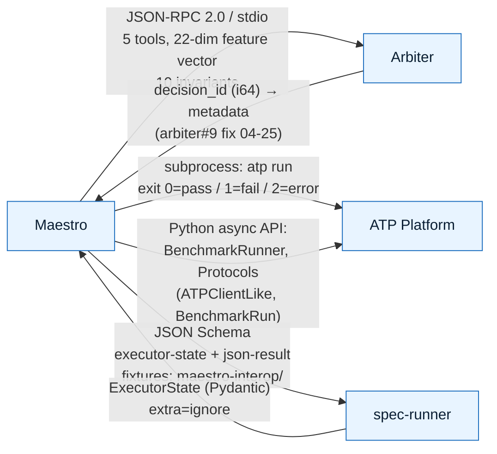
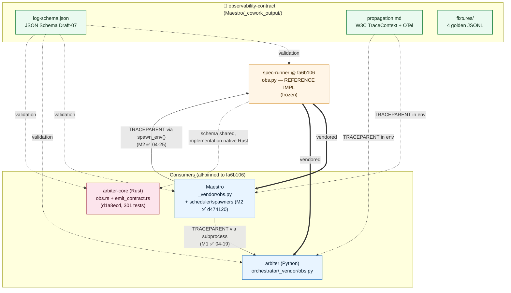

# Structural diagram of project interactions

> Date: 2026-05-08
> Source: `COWORK_CONTEXT.md` + contract analysis in `_cowork_output/contracts/`

## TL;DR

1. **Central hub — Maestro v0.2.0**: the only project that actively calls the others (Arbiter, ATP, spec-runner, spawner agents).
2. **ATP Platform 2.0.0 — an autonomous "receiver"**: framework-agnostic, it is invoked both by Maestro (via CLI and the benchmark API) and by agents-for-game (via MCP).
3. **Arbiter — the only MCP server**: 5 tools (route_task, report_outcome, get_agent_status, get_metrics, get_budget_status), called by Maestro over JSON-RPC 2.0 over stdio.
4. **Cross-project observability — a 4-way axis**: `log-schema.json` lives in `Maestro/_cowork_output/observability-contract/`, vendored into spec-runner (reference @ `fa6b106`), Maestro `_vendor/obs.py`, arbiter `orchestrator/_vendor/obs.py` + `arbiter-core/src/obs.rs` (Rust).
5. **Periphery (proctor, open-prose, agents-for-game, spec-runner-tasks)** — no direct runtime links to the core; either paused, or sandboxes, or markdown tasks.

---

## Diagram 1. Runtime interaction map (who calls whom)

```mermaid
flowchart TB
    classDef core fill:#e8f4ff,stroke:#1e6fbf,stroke-width:2px,color:#0b1f33
    classDef receiver fill:#fff5e6,stroke:#cc7a00,stroke-width:2px,color:#3d2400
    classDef peripheral fill:#f5f5f5,stroke:#888,stroke-width:1px,color:#333,stroke-dasharray: 4 4
    classDef contract fill:#eafaf0,stroke:#2a8a4a,stroke-width:1.5px,color:#0f2e1a
    classDef external fill:#fce4ec,stroke:#a73357,stroke-width:1.5px,color:#3a0d1c

    subgraph CORE["Active core (production / stable)"]
        M[Maestro v0.2.0<br/>DAG orchestrator<br/>Python 3.12]:::core
        AR[Arbiter v0.1.0<br/>MCP server<br/>Rust + Python]:::core
        ATP[ATP Platform 2.0.0<br/>framework-agnostic<br/>tests/evaluation]:::receiver
        SR[spec-runner v2.0.0<br/>markdown → tasks<br/>Claude CLI]:::core
    end

    subgraph SPAWNED["External agents (spawned in git worktrees)"]
        CC[Claude Code]:::external
        CDX[Codex]:::external
        AID[Aider]:::external
    end

    subgraph PERI["Periphery / sandboxes"]
        PA[proctor<br/>Phase 2, paused since 04-16]:::peripheral
        OP[open-prose<br/>spec-only, no runtime]:::peripheral
        AFG[agents-for-game<br/>El Farol/Prisoner sandbox]:::peripheral
        SRT[spec-runner-tasks<br/>cowork tasks]:::peripheral
    end

    %% --- Maestro as caller ---
    M -->|"MCP route_task / report_outcome<br/>JSON-RPC 2.0 over stdio<br/>vendored @ 861534e"| AR
    M -->|"validation_cmd → atp run<br/>subprocess, exit 0/1/2 (R-06a)"| ATP
    M -->|"benchmark/ async runner<br/>BenchmarkRunner + Protocols (R-06b M1)"| ATP
    M -->|"subtasks: JSON Schema<br/>executor-state + json-result (R-04)"| SR
    M -->|"spawn in worktree"| CC
    M -->|"spawn in worktree"| CDX
    M -->|"spawn in worktree"| AID

    %% --- agents-for-game uses ATP MCP ---
    AFG -->|"MCP client<br/>El Farol / Prisoner"| ATP

    %% --- spec-runner-tasks reads spec-runner ---
    SRT -.->|"markdown tasks<br/>(content, not runtime)"| SR

    %% --- Other links: open-prose as an idea ---
    OP -.->|"inspires the format<br/>of spec-runner specs"| SR
```



### Arrow legend

| Arrow type | Semantics |
|---|---|
| `-->` solid | Real runtime call (subprocess / MCP / async API) |
| `-.->` dashed | Conceptual link, no runtime dependency |

---

## Diagram 2. Contract points and protocols



### Contracts by the numbers

| Contract | Side A | Side B | Protocol | Status | Frozen at |
|---|---|---|---|---|---|
| route_task / report_outcome | Maestro | Arbiter | MCP / JSON-RPC 2.0 stdio | 🟢 SHIPPED | `arbiter@861534e` (vendored) |
| validation_cmd | Maestro | ATP | CLI subprocess `atp run` | 🟢 R-06a closed | `docs/maestro-integration.md` |
| benchmark API | Maestro | ATP | Python async + Protocols | 🟡 M1 ✅, M2..M5 pending | `5758dd8` (2026-05-07) |
| subtasks | Maestro | spec-runner | JSON Schema | 🟢 R-04 frozen | `tests/fixtures/maestro-interop/` |
| spawn | Maestro | Claude Code/Codex/Aider | git worktree + env | 🟢 stable | `spawners/` |
| MCP El Farol | agents-for-game | ATP | MCP | 🧪 sandbox | — |

---

## Diagram 3. Observability — the cross-project axis



### Observability milestones

| Milestone | Date | Artifact | What was closed |
|---|---|---|---|
| M1 | 2026-04-19 | TRACEPARENT via subprocess | Trace ID flows into spawned processes |
| M2 | 2026-04-25 (`d474120`) | scheduler+spawners instrumented | OTel spans (`scheduler.session`, `task.spawn`); live JSONL works |
| arbiter obs v1 | 2026-04-25 (`d1a8ecd`) | `arbiter-core/src/obs.rs` | Rust validated against the shared log-schema.json |
| M3 | 🟡 pending | per-tick metrics, routing decision span, dashboards | — |

---

## Diagram 4. Ecosystem layers

```mermaid
flowchart TB
    classDef l1 fill:#fde4e1,stroke:#c33,color:#3a0d1c
    classDef l2 fill:#fff3cd,stroke:#b8860b,color:#3a2c00
    classDef l3 fill:#e8f4ff,stroke:#1e6fbf,color:#0b1f33
    classDef l4 fill:#eafaf0,stroke:#2a8a4a,color:#0f2e1a
    classDef l5 fill:#f5f5f5,stroke:#888,color:#333

    subgraph L1["L1 — Routing / policy"]
        AR1[Arbiter<br/>policy engine, MCP tools<br/>22-dim → decision tree]:::l1
    end

    subgraph L2["L2 — Orchestration / DAG"]
        M1[Maestro<br/>YAML tasks.yaml/project.yaml<br/>scheduler + spawners + worktrees]:::l2
        SR1[spec-runner<br/>markdown → Claude CLI tasks<br/>verify + report]:::l2
    end

    subgraph L3["L3 — Executors (agents)"]
        CC1[Claude Code]:::l3
        CDX1[Codex]:::l3
        AID1[Aider]:::l3
        AFG1[agents-for-game<br/>El Farol / Prisoner bots]:::l3
    end

    subgraph L4["L4 — Evaluation / testing"]
        ATP1[ATP Platform<br/>12+ adapters, 13+ evaluators<br/>Tournament, Hall of Fame]:::l4
    end

    subgraph L5["L5 — Specifications / content"]
        OP1[open-prose<br/>spec language]:::l5
        SRT1[spec-runner-tasks<br/>markdown tasks]:::l5
    end

    subgraph L6["L⊥ — Cross-cutting"]
        OBS[observability-contract<br/>log-schema + propagation + fixtures]:::l4
        PA1[proctor (paused)]:::l5
    end

    L1 --> L2
    L2 --> L3
    L2 --> L4
    L3 --> L4
    L5 -.-> L2
    OBS -.-> L1
    OBS -.-> L2
    OBS -.-> L3
    OBS -.-> L4
```

---

## Summary table "who calls whom"

| Source | Target | Channel | Purpose | Status |
|---|---|---|---|---|
| Maestro | Arbiter | MCP / JSON-RPC stdio | Task routing + outcome feedback | 🟢 |
| Maestro | ATP | CLI subprocess (`atp run`) | Validation of task results | 🟢 R-06a |
| Maestro | ATP | Python async (BenchmarkRunner) | Agent benchmarking | 🟡 M1 ✅ |
| Maestro | spec-runner | JSON Schema interop | Delegation of subtasks | 🟢 R-04 frozen |
| Maestro | Claude Code | spawn + worktree | Launch of a coding agent | 🟢 |
| Maestro | Codex | spawn + worktree | Launch of a coding agent | 🟢 |
| Maestro | Aider | spawn + worktree | Launch of a coding agent | 🟢 |
| agents-for-game | ATP | MCP | El Farol / Prisoner sandbox | 🧪 |
| spec-runner-tasks | spec-runner | markdown content | Source of tasks | 📄 |
| open-prose | spec-runner | conceptual | Idea of the spec language | 📄 |
| proctor | — | — | Paused since 2026-04-16 | ⏸ |

---

## Recommended actions

1. **Maestro `M3` observability (🟡 pending)** — close per-tick metrics, the routing-decision span, and dashboards. Without this, arbiter and Maestro are formally compatible, but the routing reasoning cannot be traced in production.
2. **R-06b M2..M5 (🟡 pending)** — especially the open design question M4: a new MCP tool `report_benchmark` vs. a channel in `report_outcome`. This is an important fork in the Maestro↔arbiter↔ATP contract; better to pin an ADR in `_cowork_output/decisions/` before implementation begins.
3. **proctor** — 22 days of pause. Either explicitly close it in the registry (like pylon), or assign an owner and a resumption timeline.
4. **agents-for-game without VCS** — this is a documented decision, but it is worth at least periodically snapshotting the state (for example, in `_cowork_output/snapshots/`) so as not to lose the bot configs between sessions.
5. **Cross-vendor pin spec-runner@fa6b106** — all 4 consumers are hard-pinned to a single revision of the reference impl. Before any update of `obs.py` in spec-runner, a synchronized rollout across the 4 projects is needed — it is worth pinning this invariant in `_cowork_output/contracts/observability.md`.
