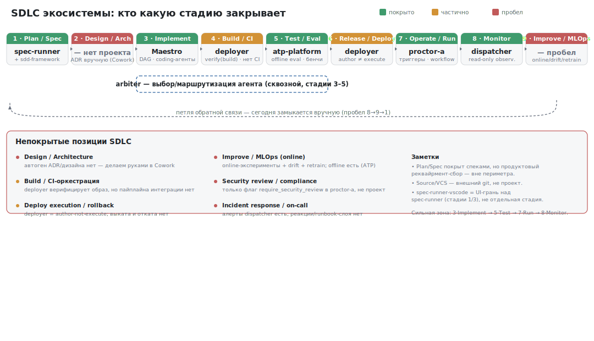
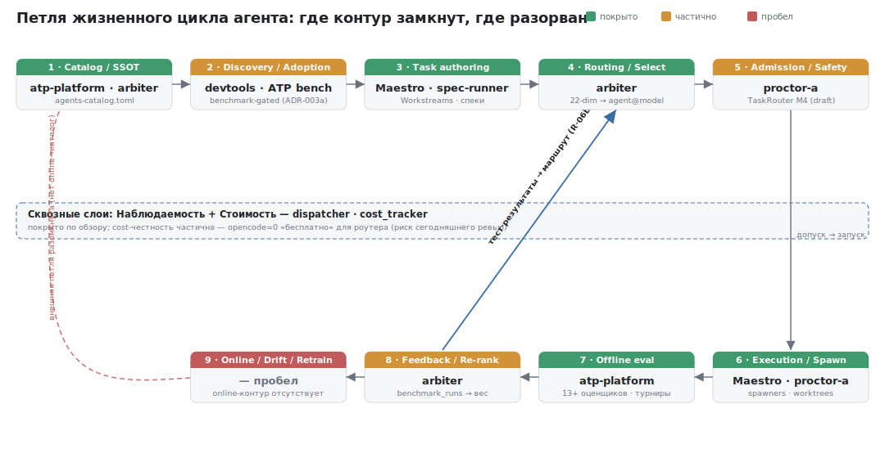

# Mapping projects to the SDLC and the agent lifecycle loop

**Date:** 2026-07-05
**Author:** Cowork TPM/architect
**Projects:** Maestro, arbiter, deployer, dispatcher, proctor, spec-runner, atp-platform
**Diagrams:** `2026-07-05-sdlc-coverage.svg`, `2026-07-05-agent-lifecycle-loop.svg` (in this folder)

## TL;DR

1. Two lenses give different conclusions. **SDLC lens:** the ecosystem is strong at "build and verify," weak at "release, operate in prod, learn from prod." **Agent-lifecycle lens:** the agents' self-learning loop is closed, but it spins on **offline** data; for honesty it needs an online/drift stage and cost honesty.
2. The tightly closed zone is the same in both diagrams: **Implement → Test → Run → Monitor** (Maestro → ATP → proctor → dispatcher).
3. The most significant gap is the **right side of the lifecycle**: deploy-execution/rollback (deployer = author-not-execute) and the online loop (Improve/MLOps). They connect: the prod→development feedback loop is closed by hand today.
4. The defect of the cross-cutting cost layer (`opencode cost=0`, a risk in today's Maestro review) directly damages the closing of the agent loop: the re-rank stage may re-rank in favor of a "free" agent. This is not cosmetic.

---

## Diagram 1 — the classic SDLC

| SDLC stage | Project | Coverage |
|---|---|---|
| 1 · Plan / Spec | spec-runner (+ sdd-framework) | covered (tech spec; product requirement — not) |
| 2 · Design / Architecture | — | **gap** (ADR by hand in Cowork) |
| 3 · Implement | Maestro (DAG, coding agents) | covered |
| 4 · Build / CI | deployer (`verify` = docker build) | partial (no CI orchestration) |
| 5 · Test / Eval | atp-platform | covered (flagship) |
| 6 · Release / Deploy | deployer (author ≠ execute) | partial (no rollout/rollback) |
| 7 · Operate / Run | proctor (triggers, workflow) | covered |
| 8 · Monitor | dispatcher (read-only observability) | covered |
| 9 · Improve / MLOps | — | **gap** (online/drift/retrain) |

**arbiter** — the cross-cutting layer "which agent will perform the task" (on top of stages 3–5), not tied to a single stage.

### Uncovered SDLC positions
- **Design / Architecture** — no auto-generation of ADR/design.
- **Build / CI orchestration** — there is image verification, no integration pipeline.
- **Deploy execution / rollback** — deployer authors the artifact but does not roll it out.
- **Improve / MLOps (online)** — online experiments + drift + retrain; offline exists (ATP).
- **Security review / compliance** — only the `require_security_review` flag in proctor, not a project.
- **Incident response / on-call** — dispatcher alerts exist, runbook reactions do not.
- Source/VCS — external git (not a project); spec-runner-vscode — a UI facet over spec-runner, not a separate stage.

---

## Diagram 2 — the agent lifecycle loop

This lens is more honest for the ecosystem: the projects build software *by the hands of AI agents*, so the real "stages" are the agent lifecycle, not the human SDLC.

| Loop stage | Project(s) | Coverage |
|---|---|---|
| 1 · Catalog / SSOT | atp-platform · arbiter (`agents-catalog.toml`) | covered |
| 2 · Discovery / Adoption | devtools · ATP bench (benchmark-gated, ADR-003a) | partial (prototype) |
| 3 · Task authoring | Maestro · spec-runner | covered |
| 4 · Routing / Select | arbiter (22-dim → agent@model) | covered |
| 5 · Admission / Safety | proctor TaskRouter (M4, draft) | partial |
| 6 · Execution / Spawn | Maestro · proctor (spawners, worktrees) | covered |
| 7 · Offline eval | atp-platform (13+ evaluators, tournaments) | covered |
| 8 · Feedback / Re-rank | arbiter (benchmark_runs → weight) | partial (R-07 crossover-null; routing on real data open) |
| 9 · Online / Drift / Retrain | — | **gap** |
| Cross-cutting · Observability + Cost | dispatcher · cost_tracker | covered; cost honesty partial (`opencode=0`) |

### What the second diagram shows
- **The inner loop is closed** (4 → 5 → 6 → 7 → 8 → 4): "route cheapest sufficient from test results." A self-improving loop on top of agents is rare, it is a strength.
- **The outer loop is open** (stage 9): there is no feedback *from prod* back into the catalog/discovery. The loop optimizes agents for the **benchmark**, not for reality — the classic offline/online mismatch.
- **Two "partials" at the boundaries:** Feedback (the signal is weak — R-07 tiebreaker) and Admission (proctor TaskRouter, review 2026-07-05).
- **Cost honesty is the thin spot of the cross-cutting layer:** the `opencode=0` defect hits stage 8.

---

## Recommended actions

- **[direction]** Priority to close — stage 9 (online/drift/retrain) + deploy-execution: this closes both the SDLC loop (8→9→1) and the outer agent loop. Design the seams, don't build it all at once (see idea-mlops-layer).
- **[Maestro, from the review]** Cost honesty as a precondition for an honest re-rank: exclude `opencode=0` from the cost rank (0 = unknown, not free).
- **[arbiter]** Bring Feedback/Re-rank from offline to real data (routing by a live signal) — from "partial" to "covered."
- **[Design/Arch]** Deliberately left to humans (Cowork review of specs) — record this as a decision, not a forgotten gap.
